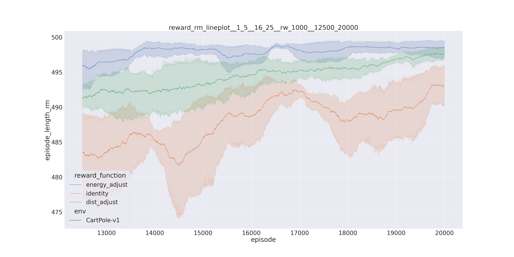

# gym_sandbox

A repository for training RL models in Gymnasium environments with a modular architecture for quick
prototyping.

## Overview

* **main.py** : "high-level" interface for repository main functionality.
* **train_pipeline.py** : training pipeline parameterized by train_pipeline_params.json.
* **plot_pipeline.py** : plotting pipeline parameterized by plot_params.json.
* **models.py** : module containing deep learning model classes.
* **train_algorithms.py** : module containing reinforcement learning algorithm classes.
* **reward_functions.py** : module containing custom reward functions.
* **models** : directory containing training runs (trained models, training statistics & videos).
* **plots** : directory containing all plots generated by plot_pipeline.
* **params** : directory containing all parameters as json files.

## Installation

Python 3.8.16 

* git clone ... change to root directory
* virtualenv --python=/usr/bin/python3.8 venv
* source venv/bin/activate
* pip install -r requirements.txt
* python3 -m gym_sandbox train (to run train_pipeline.py)
* python3 -m gym_sandbox plot (to run plot_pipeline.py)

## CartPole-v1

